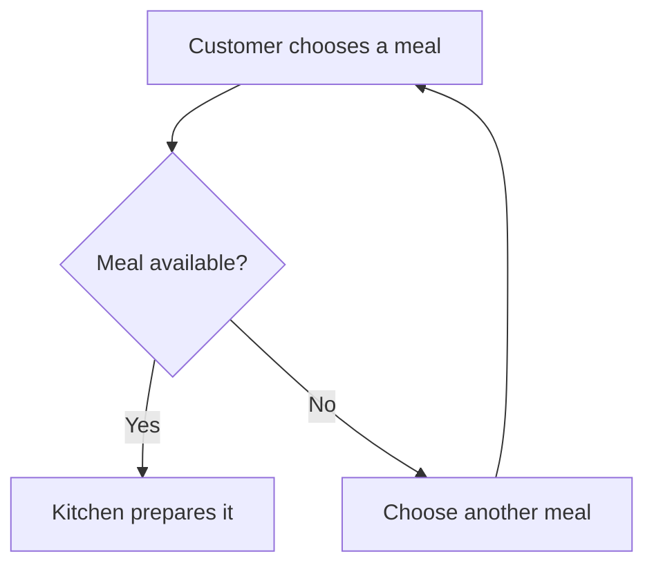

# Diagrams and drawings that stay editable

Use a diagram when relationships, sequence, branching or position make an explanation easier to follow.
Keep the explanation beside it. Label assumptions and unknowns; a neat drawing does not verify a claim.
Use the document's style and Rapier's defaults, short labels and prose explaining the important path.

## Two kinds, kept apart

A native SVG diagram is made with `document.draw`: named figures the person can move, restyle, connect and
extend on Rapier's canvas, saved as SVG in the document. A Mermaid flowchart is a `mermaid` fence in the
Markdown source, inserted with `document.edit`; Rapier renders the supported grammar offline and the
file keeps the text. A drawing is not Mermaid and a fence is not a drawing. Choose the drawing when shapes
should be moved and edited by hand; choose the fence when the flowchart must stay plain text in any
Markdown editor.

## Put the diagram in the working document

For an open Rapier document, read the intended passage and insert Markdown through `document.edit`,
or use `document.draw` for native figures. A request to make a diagram is a request to make it there;
do not ask the person to paste source that the available tools can insert.

For a new workspace, put this Markdown straight into `rapier.open.text`. No insertion marker or second
drawing call is needed. The four-backtick wrapper below displays the example only; send its contents
as `text`. When showing source in chat, never nest Mermaid inside an outer triple-backtick fence.
Use a wrapper longer than every backtick run in the source, or provide the Markdown file.

````md
# When an order reaches the kitchen

The availability check decides whether an order can go ahead. An unavailable meal returns to the customer
for another choice; the kitchen receives only an available order.



Which part would you change? Add your notes here.
````

Native, offline Mermaid supports `flowchart` or `graph`, directions `TD`, `TB`, `BT`, `LR`, `RL`,
plain text labels, one level of `subgraph`, and common node shapes. Edges include `-->`, `---`, `-.->`,
`-.-`, `==>`, `<-->` and `<-.->`, with captions. `classDef`, `class` and `style` support `fill`, `stroke`
and `color` only. Use plain labels, not HTML, click actions, initialization directives or nested groups.
Other diagram families and unsupported constructs need the separately loaded Mermaid plugin. Do not
promise them offline or assume a diagram type supported by the chat host is native in Rapier.

The fence stays Mermaid source. Native label editing changes node labels, captions and group titles;
topology changes through inspected source edits. Use native drawings for freely movable geometry.
Close a Mermaid block with the same marker character and at least the opening length before resuming prose.
An unclosed block keeps the remaining text as literal source and shows a warning. Read the exact source
and insert the missing fence at the intended boundary; do not delete trailing prose to make a diagram parse.
If a refusal identifies unsupported syntax, simplify it without changing meaning or use native figures.
Do not silently discard connections or claim that the result rendered without observation.

## Native figures

`document.draw` can create this diagram with no coordinates. Supply the MCP workspace handle and a
fresh operation ID as usual; examples here show only the operation payload. Creation requires target kind
`create`; add `context_handle` inside that target to insert after an inspected passage. Otherwise it appends.

```json
{"target":{"kind":"create"},"alt":"An order with an availability decision","figures":[
  {"kind":"rect","id":"order","label":"Choose a meal"},
  {"kind":"diamond","id":"available","label":"Available?"},
  {"kind":"rect","id":"kitchen","label":"Prepare meal"},
  {"kind":"rect","id":"choice","label":"Another choice"},
  {"kind":"arrow","from":"order","to":"available"},
  {"kind":"arrow","from":"available","to":"kitchen","label":"Yes"},
  {"kind":"arrow","from":"available","to":"choice","label":"No"},
  {"kind":"arrow","from":"choice","to":"order"}
]}
```

Figure discriminators are `kind`; operation discriminators are `type`. Name nodes with stable `id`s.
Use `rect`, `diamond`, `ellipse`, `circle`, `triangle`, `hexagon`, `cylinder`, `subroutine`, `asymmetric`
or `text`. A `group` takes `title` and `members`; `arrow` and `line` take `from` and `to` as IDs, labels
or points. Set `direction` to `down`, `across`, `up` or `back`; omit it for down. Rapier measures labels
and routes bound connectors. A drawing is an SVG image carrying its semantic recipe.

For a spatial sketch, coordinates are meaningful. This creates a garden arrangement:

```json
{"target":{"kind":"create"},"alt":"Two garden beds beside a path","figures":[
  {"kind":"rect","id":"herbs","label":"Herbs","x":0,"y":0,"w":180,"h":110},
  {"kind":"rect","id":"greens","label":"Greens","x":240,"y":0,"w":180,"h":110},
  {"kind":"rect","id":"path","label":"Path","x":0,"y":160,"w":420,"h":70}
]}
```

Call this an arrangement, not a scaled plan unless real dimensions are supplied. The person can move
shapes, relabel, recolour, draw and paint on the canvas. Agents can also paint with the same brush engine
when this host carries Paint. Send a paint figure with a stable id and ordered strokes (`figures` creates a drawing; to paint on a drawing that already exists, or that the person has open, put `{"kind":"paint","strokes":[...]}` in `shapes.add` or `shapes.replace`):

```json
{"target":{"kind":"create"},"alt":"A blue brush stroke","figures":[{"kind":"paint","id":"wash","strokes":[
  {"brush":"rapier/oil","colour":"#2255cc","size":30,"load":0.6,"water":0.2,
   "points":[[20,50,0.7],[60,55,0.7],[100,45,0.7],[140,50,0.7]]}
]}]}
```

`points` are drawing coordinates with optional pressure from 0 to 1. `size` is 0 to 100; omitted, it is the
brush's own first-use size. `rapier.guide({topic: "paint"})` returns the current brush registry and control ranges/defaults.
`load` and `water` are 0 to 1. `angle` is 0 to 179 degrees (45 when omitted), the angle a brush whose head is
not round is held at; `follow: true` turns the head with the stroke instead, and `erase: true` makes a brush
take paint off with its own head (a brush that works the paint already on the layer, such as smudge or blend,
ignores it). A figure's `seed` (an integer from 0 to 2,147,483,647, default 1) fixes the brush's random choices,
so the same strokes paint the same marks. Brush ids come from the shipped registry, including `rapier/scumble`,
`rapier/flat`, `rapier/pencil` and `rapier/pen`. A paint figure takes at most
32 strokes, 1,024 points per stroke and 4,096 points in total, counting one stationary starting sample
added to each new stroke, within a 2,048-pixel sheet. An eraser or
blender needs existing pigment in that same layer; an empty resulting picture is refused. Painting
is not available in a build without Paint. Do not claim a refused or accepted-but-pending call created marks. Read `receipt.state` and
`receipt.presentation` separately; retry retained material work with the same operation ID and arguments.

A paint figure with `mode: "water"` paints pigment into wet paper instead. It takes `actions` in place of `strokes`
(`stroke`, `water`, `lift`, `fill`, `dry`, `advance`, `paper`, `tip`, `text` and `trace`; stroke points are
`[x, y, pressure, tick]` with integer ticks at 60 a second), and the paint guide lists Water brushes, pigments, papers and
tools with an example of every action. A paper changes only how the paint behaves; the layer stays transparent over the
drawing's own canvas and background. `document.read` with target kind `drawing` and `paintSample: {objectId, point}` samples pigment at
a point of an inspected Water layer. The result reports renderer availability/pending/sample facts, not pixels or a source change. A figure that mixes strokes and actions is refused as `paint_mode_mismatch`.

## Edit an imported SVG

Read the picture occurrence with `document.read({target: {kind: "svg", context_handle: imageHandle}})`.
Follow cursor-only continuations until the tree is complete. Pass the returned `svg_handle` to `svg.edit` with `node_edits`. Each entry names a disclosed `id` and the changed
`text`, `attributes`, `style` or `geometry`; `null` removes an optional attribute or style property.
Optional `alt` changes the picture caption alongside the node edits. Untouched SVG bytes stay intact.
Unsafe values are refused with the field named.

## Change one object

Read the image occurrence with `document.read({target: {kind: "drawing", context_handle: imageHandle}})`
and follow every cursor-only continuation. Use the returned `recipe_handle` in
`document.draw({target: {kind: "edit", recipe_handle}, ...patch})`. An optional `objectId` narrows authority
to that object. Source reads do not automatically inspect drawings; never use a source handle as a recipe handle.

- Move an inspected object with `operations: [{"type":"move","ids":["herbs"],"dx":40,"dy":0}]` and the read
  handle in `target: {kind: "edit", recipe_handle}`. The batch (up to 64 operations, applied in order) takes every edit the person's
  controls make and lands whole or not at all; a refusal names the operation and field.
- Change a label by copying the exact shape from the read recipe, changing its `label`, then sending
  `shapes: {replace: [updatedShape]}` with the read handle in `target: {kind: "edit", recipe_handle}`. A replacement is a complete
  shape, not just `id` and `label`. Preserve geometry, style and bindings.
- Add or remove with `shapes.add` or `shapes.remove`. Connectors may name existing IDs or later additions in the same patch; replacements may also name
  additions. New groups may contain the new automatically laid-out figures. Use `direction` (`down`,
  `across`, `up`, `back`) for those figures. Position additions
  deliberately; do not relayout the whole drawing for a narrow change.
- Preserve a disclosed paint raster's `{kept:true}` marker when replacing its shape. Never manufacture
  pixel bytes or replace a layer because its bytes were redacted in the read. Keep its `paint` record
  unchanged too: different replay strokes with retained old pixels are refused. To paint more on that
  layer, put a `kind: "paint"` figure with its id and the new strokes in `shapes.replace`: they lay on the
  layer's own pixels, which keep their transform and every other field, and the sheet grows, up to 2,048
  pixels a side, to take a stroke that leaves it. A missing id answers `paint_target_invalid`, a locked layer
  `paint_target_locked` and a layer the person changed meanwhile `paint_target_changed` (read it again, then
  resend). To start a layer over, remove it and add a new paint figure.
- Change only the caption with the edit target and `alt`; no dummy shape operation is needed.
- Move the drawing's own dials with `shapes: {set: {...}}` and `target: {kind: "edit", recipe_handle}`: `background`,
  `paper` (`white` or `black`), `effect`, `canvas` (`{w, h}`), `frame` (`{x, y, w, h}`), `light` (radians), `smooth`
  (0 to 100) and `nib` (2 to 24). Each member replaces the one it names, whole. `null` removes a background,
  effect, frame or paper (the paper then follows the reader's light or dark page, the frame the ink). A background or effect that
  names only its `kind` or `preset` takes the person's starting values for every number left out. A dial that
  does not admit refuses the whole patch, its shapes included, and names the field (`background.curtains`,
  `effect.copies`, `canvas`). A `set` lands on the person's open canvas as one Undo step, beside any `add`,
  `replace` or `remove` in the same patch.
- For strokes, fonts or other drawing-wide fields, send the complete inspected `recipe` with
  `target: {kind: "edit", recipe_handle}`. Keep every unrelated field and paint marker. Do not combine
  `recipe` with `shapes` or `figures`; an `operations` batch may follow the recipe change.

While a person has the drawing open, a `shapes` patch (its `set` included), an `operations` batch and a
complete inspected `recipe` use the same canvas hand-off. An admitted change commits to the document and
lands on their canvas as one Undo step; while a gesture is active, presentation waits for their hand to lift.
A shape or dial the person has changed on the canvas and not yet saved stays theirs: the agent's change is in
the document and one Undo away. A refused recipe names the first field that stopped it (`field`).

Keep the returned act ID for inspection and Undo. Where the person has painted on a layer since, `document.undo` with that act
takes back the agent's strokes by replaying the layer's history without them, so the person's strokes stay. A
new agent contribution whose replay would exceed 8 MiB is refused as `paint_history_full`; the painting
and its existing replay stay intact. Use `shapes.add` to paint on a new layer. If the person changed the
image meanwhile, a fresh read establishes the new recipe.
