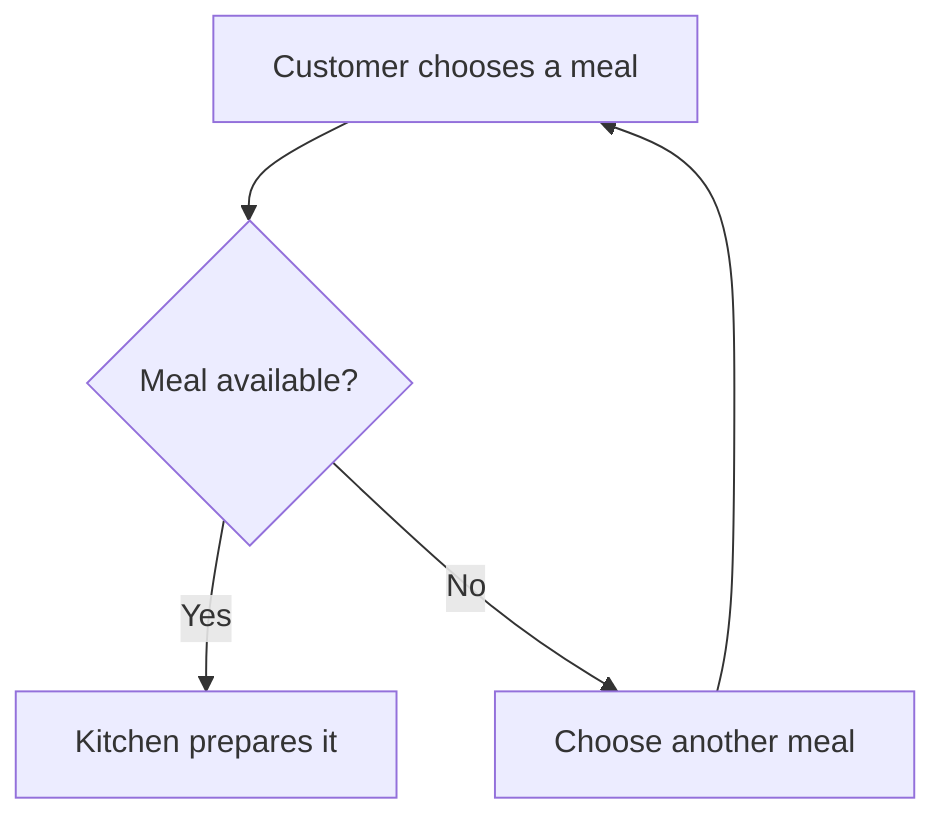

# Diagrams and drawings that stay editable

Use a diagram when relationships, sequence, branching or position make an explanation easier to follow.
Keep the explanation beside it. Label assumptions and unknowns; a neat drawing does not verify a claim.
Use the document's style and Rapier's defaults, short labels and prose explaining the important path.

## One call for prose and a flowchart

Put this Markdown straight into `rapier.open.text`. No insertion marker or second drawing call is needed.

````md
# When an order reaches the kitchen

The availability check decides whether an order can go ahead. An unavailable meal returns to the customer
for another choice; the kitchen receives only an available order.



Which part would you change? Add your notes here.
````

Native, offline Mermaid supports `flowchart` or `graph`, directions `TD`, `TB`, `BT`, `LR`, `RL`,
plain text labels, one level of `subgraph`, and common node shapes. Edges include `-->`, `---`, `-.->`,
`-.-`, `==>`, `<-->` and `<-.->`, with captions. `classDef`, `class` and `style` support `fill`, `stroke`
and `color` only. Use plain labels, not HTML, click actions, initialization directives or nested groups.
Other diagram families and unsupported constructs need the separately loaded Mermaid plugin. Do not
promise them offline or assume a diagram type supported by the chat host is native in Rapier.

The fence stays Mermaid source. Native label editing changes node labels, captions and group titles;
topology changes through inspected source edits. Use native drawings for freely movable geometry.
If a refusal identifies unsupported syntax, simplify it without changing meaning or use native figures.
Do not silently discard connections or claim that the result rendered without observation.

## Native figures

`document.draw` can create this diagram with no coordinates. Supply the MCP document capability and a
fresh operation ID as usual; examples here show only the operation payload.

```json
{"alt":"An order with an availability decision","figures":[
  {"kind":"rect","id":"order","label":"Choose a meal"},
  {"kind":"diamond","id":"available","label":"Available?"},
  {"kind":"rect","id":"kitchen","label":"Prepare meal"},
  {"kind":"rect","id":"choice","label":"Another choice"},
  {"kind":"arrow","from":"order","to":"available"},
  {"kind":"arrow","from":"available","to":"kitchen","label":"Yes"},
  {"kind":"arrow","from":"available","to":"choice","label":"No"},
  {"kind":"arrow","from":"choice","to":"order"}
]}
```

Figure discriminators are `kind`; operation discriminators are `type`. Name nodes with stable `id`s.
Use `rect`, `diamond`, `ellipse`, `circle`, `triangle`, `hexagon`, `cylinder`, `subroutine`, `asymmetric`
or `text`. A `group` takes `title` and `members`; `arrow` and `line` take `from` and `to` as IDs, labels
or points. Set `direction` to `down`, `across`, `up` or `back`; omit it for down. Rapier measures labels
and routes bound connectors. A drawing is an SVG image carrying its semantic recipe.

For a spatial sketch, coordinates are meaningful. This creates a garden arrangement:

```json
{"alt":"Two garden beds beside a path","figures":[
  {"kind":"rect","id":"herbs","label":"Herbs","x":0,"y":0,"w":180,"h":110},
  {"kind":"rect","id":"greens","label":"Greens","x":240,"y":0,"w":180,"h":110},
  {"kind":"rect","id":"path","label":"Path","x":0,"y":160,"w":420,"h":70}
]}
```

Call this an arrangement, not a scaled plan unless real dimensions are supplied. The person can move
shapes, relabel, recolour, draw and paint on the canvas. Document tools edit objects and preserve painted
layers; they do not supply an agent brush-painting command.

## Change one object

Read the image occurrence through `document.read_context` for its recipe and a current handle.
Do not use a source-text handle as a recipe handle or guess IDs from the rendered picture.

- Move an inspected object with `operations: [{"type":"move","ids":["herbs"],"dx":40,"dy":0}]`.
- Change a label by copying the exact shape from the read recipe, changing its `label`, then sending
  `shapes: {replace: [updatedShape]}` with the read handle as `recipe_handle`. A replacement is a complete
  shape, not just `id` and `label`. Preserve geometry, style and bindings.
- Add or remove with `shapes.add` or `shapes.remove`. Bind connectors to existing IDs. Position additions
  deliberately; do not relayout the whole drawing for a narrow change.
- Preserve a disclosed paint raster's `{kept:true}` marker when replacing its shape. Never manufacture
  pixel bytes or replace a layer because its bytes were redacted in the read.

Keep the change ID for inspection and Undo. Under ASK a drawing waits for review; read it again after
approval. If the person changed the image meanwhile, a fresh read establishes the new recipe.
