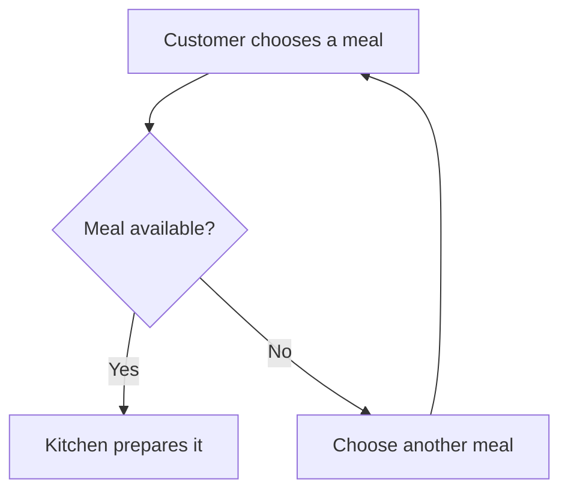

# Diagrams and drawings that stay editable

Use a diagram when relationships, sequence, branching or position make an explanation easier to follow.
Keep the explanation beside it. Label assumptions and unknowns; a neat drawing does not verify a claim.
Use the document's style and Rapier's defaults, short labels and prose explaining the important path.

## Put the diagram in the working document

For an open Rapier document, read the intended passage and insert Markdown through `document.apply_edits`,
or use `document.draw` for native figures. A request to make a diagram is a request to make it there;
do not ask the person to paste source that the available tools can insert.

For a new workspace, put this Markdown straight into `rapier.open.text`. No insertion marker or second
drawing call is needed. The four-backtick wrapper below displays the example only; send its contents
as `text`. When showing source in chat, never nest Mermaid inside an outer triple-backtick fence.
Use a wrapper longer than every backtick run in the source, or provide the Markdown file.

````md
# When an order reaches the kitchen

The availability check decides whether an order can go ahead. An unavailable meal returns to the customer
for another choice; the kitchen receives only an available order.



Which part would you change? Add your notes here.
````

Native, offline Mermaid supports `flowchart` or `graph`, directions `TD`, `TB`, `BT`, `LR`, `RL`,
plain text labels, one level of `subgraph`, and common node shapes. Edges include `-->`, `---`, `-.->`,
`-.-`, `==>`, `<-->` and `<-.->`, with captions. `classDef`, `class` and `style` support `fill`, `stroke`
and `color` only. Use plain labels, not HTML, click actions, initialization directives or nested groups.
Other diagram families and unsupported constructs need the separately loaded Mermaid plugin. Do not
promise them offline or assume a diagram type supported by the chat host is native in Rapier.

The fence stays Mermaid source. Native label editing changes node labels, captions and group titles;
topology changes through inspected source edits. Use native drawings for freely movable geometry.
Close a Mermaid block with the same marker character and at least the opening length before resuming prose.
An unclosed block keeps the remaining text as literal source and shows a warning. Read the exact source
and insert the missing fence at the intended boundary; do not delete trailing prose to make a diagram parse.
If a refusal identifies unsupported syntax, simplify it without changing meaning or use native figures.
Do not silently discard connections or claim that the result rendered without observation.

## Native figures

`document.draw` can create this diagram with no coordinates. Supply the MCP document capability and a
fresh operation ID as usual; examples here show only the operation payload.

```json
{"alt":"An order with an availability decision","figures":[
  {"kind":"rect","id":"order","label":"Choose a meal"},
  {"kind":"diamond","id":"available","label":"Available?"},
  {"kind":"rect","id":"kitchen","label":"Prepare meal"},
  {"kind":"rect","id":"choice","label":"Another choice"},
  {"kind":"arrow","from":"order","to":"available"},
  {"kind":"arrow","from":"available","to":"kitchen","label":"Yes"},
  {"kind":"arrow","from":"available","to":"choice","label":"No"},
  {"kind":"arrow","from":"choice","to":"order"}
]}
```

Figure discriminators are `kind`; operation discriminators are `type`. Name nodes with stable `id`s.
Use `rect`, `diamond`, `ellipse`, `circle`, `triangle`, `hexagon`, `cylinder`, `subroutine`, `asymmetric`
or `text`. A `group` takes `title` and `members`; `arrow` and `line` take `from` and `to` as IDs, labels
or points. Set `direction` to `down`, `across`, `up` or `back`; omit it for down. Rapier measures labels
and routes bound connectors. A drawing is an SVG image carrying its semantic recipe.

For a spatial sketch, coordinates are meaningful. This creates a garden arrangement:

```json
{"alt":"Two garden beds beside a path","figures":[
  {"kind":"rect","id":"herbs","label":"Herbs","x":0,"y":0,"w":180,"h":110},
  {"kind":"rect","id":"greens","label":"Greens","x":240,"y":0,"w":180,"h":110},
  {"kind":"rect","id":"path","label":"Path","x":0,"y":160,"w":420,"h":70}
]}
```

Call this an arrangement, not a scaled plan unless real dimensions are supplied. The person can move
shapes, relabel, recolour, draw and paint on the canvas. Agents can also paint with the same brush engine
when this host carries Paint. Send a paint figure with a stable id and ordered strokes (`figures` creates a drawing; to paint on a drawing that already exists, or that the person has open, put `{"kind":"paint","strokes":[...]}` in `shapes.add` or `shapes.replace`):

```json
{"alt":"A blue brush stroke","figures":[{"kind":"paint","id":"wash","strokes":[
  {"brush":"rapier/oil","colour":"#2255cc","size":30,"load":0.6,"water":0.2,
   "points":[[20,50,0.7],[60,55,0.7],[100,45,0.7],[140,50,0.7]]}
]}]}
```

`points` are drawing coordinates with optional pressure from 0 to 1; `size` is 0 to 100, and `load`
and `water` are 0 to 1. Brush ids come from the shipped registry, including `rapier/scumble`,
`rapier/watercolour`, `rapier/pencil`, `rapier/pen` and `rapier/marker`. A paint figure takes at most
32 strokes, 1,024 points per stroke and 4,096 points in total, within a 2,048-pixel sheet. An eraser or
blender needs existing pigment in that same layer; an empty resulting picture is refused. Painting
is not available in a build without Paint. Do not claim a refused call created marks.

## Change one object

Read the image occurrence through `document.read_context` for its recipe and a current handle.
Do not use a source-text handle as a recipe handle or guess IDs from the rendered picture.

- Move an inspected object with `operations: [{"type":"move","ids":["herbs"],"dx":40,"dy":0}]`. While the person has that drawing open, send
  only a `shapes` patch (a move is a `shapes.replace` of the moved shape); `operations` waits until they close it.
- Change a label by copying the exact shape from the read recipe, changing its `label`, then sending
  `shapes: {replace: [updatedShape]}` with the read handle as `recipe_handle`. A replacement is a complete
  shape, not just `id` and `label`. Preserve geometry, style and bindings.
- Add or remove with `shapes.add` or `shapes.remove`. Connectors may name existing IDs or later additions in the same patch; replacements may also name
  additions. New groups may contain the new automatically laid-out figures. Use `direction` (`down`,
  `across`, `up`, `back`) for those figures. Position additions
  deliberately; do not relayout the whole drawing for a narrow change.
- Preserve a disclosed paint raster's `{kept:true}` marker when replacing its shape. Never manufacture
  pixel bytes or replace a layer because its bytes were redacted in the read. Keep its `paint` record
  unchanged too: different replay strokes with retained old pixels are refused. To repaint, replace
  the inspected layer by a `kind: "paint"` figure with its id and new strokes.
- Change only the caption with `recipe_handle` and `alt`; no dummy shape operation is needed.
- For canvas size, paper, lighting, strokes, fonts or other drawing-wide fields, send the complete
  inspected `recipe` with `recipe_handle`. Keep every unrelated field and paint marker. Do not combine
  `recipe` with `shapes` or `figures`; an `operations` batch may follow the recipe change.

A whole-recipe or caption edit does not bypass the person's open drawing or Notes fence. While a person
has the drawing open, only the existing shapes-only patch exception can land; other edits must wait.

Keep the change ID for inspection and Undo. If the person changed the image meanwhile, a fresh read establishes the new recipe.
